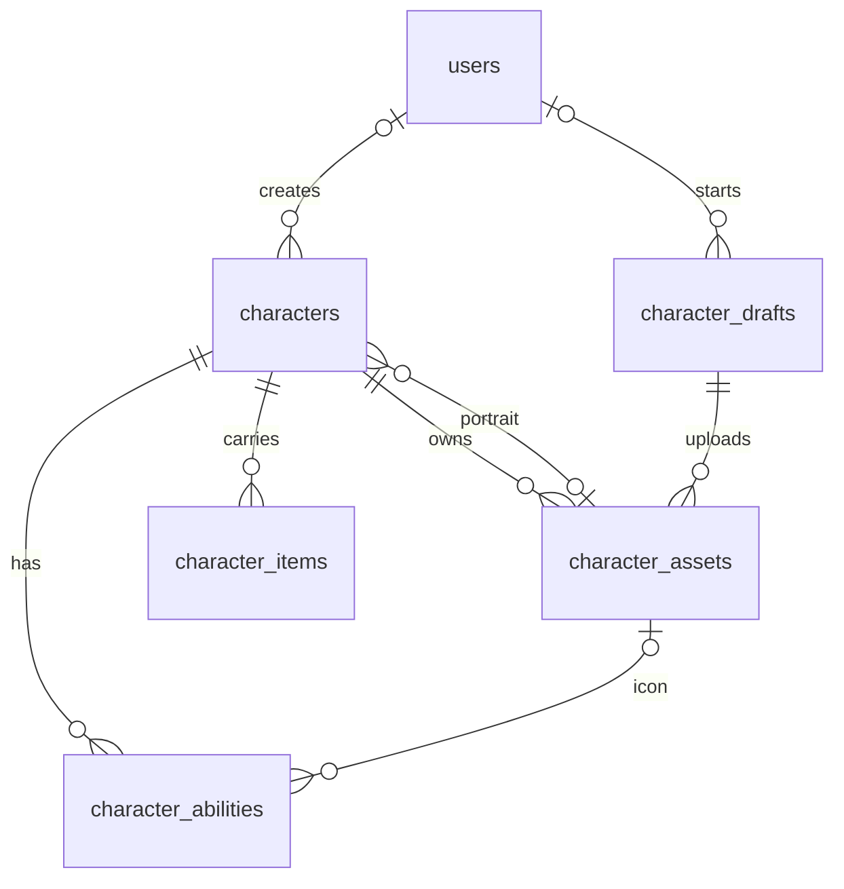

# База данных конструктора персонажей

Статус: структурная миграция `backend/migrations/000001_character_creator.up.sql` применена к облачной БД 29 сентября 2026 года. Каталог 12 классов, бюджет 14 очков и формулы HP/AC утверждены в `content/character-creation.json`.

## Граница данных и сценарий

- `content/**/*.json` остаётся каноном существующих героев, рас, лора и домашней d20-системы. Созданные игроками персонажи хранятся отдельно в PostgreSQL и отображаются только в новом конструкторе, не в общей книге героев и не в кампаниях.
- В конструкторе доступен список **всех готовых персонажей**. Будущий фильтр «Мои» выбирает строки с `creator_user_id = id текущего пользователя`. Персонажи с `creator_user_id IS NULL` остаются в общем списке, но не становятся чьими-то автоматически.
- Сейчас нет входа, записей пользователей или прав на редактирование готового персонажа. Новые записи создаются с `creator_user_id = NULL`. После добавления авторизации новые персонажи будут привязываться к авторизованному создателю; анонимные записи не получат создателя задним числом автоматически.
- До авторизации незавершённая анкета хранится только в памяти открытого frontend-конструктора. Серверного автосохранения и восстановления нет; все `/drafts` закрыты. Готовая анкета сохраняется через `POST /characters` без создания черновика. После авторизации сохранённые черновики будут привязаны к пользователю и доступны только ему. API изменения готового персонажа сейчас не существует.
- История версий персонажей не хранится. Будущее редактирование вводится отдельной миграцией и отдельными правами после авторизации, без смены UUID существующих персонажей.

## Связи

`users` — пустая до внедрения авторизации таблица идентичностей. Она не означает наличие входа в MVP.

## Таблицы первой версии

### `users` — основа будущей авторизации

| Поле | Тип | Назначение |
| --- | --- | --- |
| `id` | `uuid PK` | Внутренний стабильный ID. |
| `provider`, `provider_subject` | `text NOT NULL` | Провайдер и его ID; уникальная пара. |
| `display_name` | `text NULL` | Отображаемое имя. |
| `created_at` | `timestamptz NOT NULL` | Дата создания. |

В первой версии таблица остаётся пустой: нет регистрации, входа, сессий и OAuth. Поля `creator_user_id` в других таблицах уже могут ссылаться на неё, но пока всегда `NULL`. Позже добавятся допуск пользователей, сессии и права без перестройки данных персонажа.

### `character_drafts` — анкета во время создания

| Поле | Тип | Назначение |
| --- | --- | --- |
| `id` | `uuid PK` | ID незавершённой анкеты. |
| `creator_user_id` | `uuid NULL, FK → users.id` | Создатель после внедрения входа; сейчас `NULL`. |
| `form_data` | `jsonb NOT NULL` | Частично заполненная форма, в том числе временно невалидные поля. |
| `draft_token_hash` | `bytea NOT NULL UNIQUE` | Хеш случайного секрета для автосохранения анонимного черновика. |
| `ruleset_id` | `text NOT NULL` | Версия правил создания, по которой начата анкета. |
| `created_at`, `updated_at` | `timestamptz NOT NULL` | Время создания и последнего сохранения. |

Таблица и `draft_token_hash` сохраняют ранее применённую схему; новые анонимные черновики запрещены. Старый секрет не даёт доступ к HTTP API. После внедрения авторизации нужно проверить владельца по серверной пользовательской сессии и пересмотреть контракт токена отдельной миграцией. Старые анонимные строки не привязываются к вошедшему пользователю автоматически. Предложения AI-советника остаются в интерфейсе до принятия игроком; отдельной таблицы предложений нет.

### `characters` — готовые персонажи конструктора

| Поле | Тип | Назначение |
| --- | --- | --- |
| `id` | `uuid PK` | Стабильный внутренний ID и адрес карточки конструктора. |
| `creator_user_id` | `uuid NULL, FK → users.id` | Создатель; `NULL` допустим и ожидается до авторизации. |
| `display_name`, `pronouns`, `role_label` | `text` | Имя, местоимения и игровая роль. |
| `race_id`, `class_id` | `text NOT NULL` | Стабильные ID выбранной игровой расы и класса. |
| `story`, `motivation`, `appearance` | `text` | Художественное описание отдельно от механик. |
| `personality` | `text[]` | Черты характера. |
| `strength`, `dexterity`, `constitution`, `wisdom`, `intelligence`, `charisma` | `smallint NOT NULL` | Шесть модификаторов домашней системы. |
| `max_hp`, `base_ac` | `smallint NOT NULL` | Стартовые параметры; текущие HP игровой сессии здесь не хранятся. |
| `portrait_asset_id` | `uuid NULL, FK → character_assets.id` | Необязательный проверенный портрет. |
| `ruleset_id` | `text NOT NULL` | Правила, по которым проверен персонаж. |
| `created_at` | `timestamptz NOT NULL` | Время завершения анкеты. |
| `creation_request_hash` | `bytea NULL` | SHA-256 нормализованной анкеты для безопасного повтора сохранения; старые записи имеют NULL. |

У персонажа нет `revision_no`, `current_revision_id` и редактируемого статуса. Создание строки означает, что анкета прошла проверку и карточка видна в списке конструктора. В общей книге она не появляется. `creator_user_id` показывает, кто создал персонажа, и после записи не меняется. Отсутствие создателя не мешает просмотру. Если позже потребуется передавать право редактирования, для владельца будет отдельное поле: назначение владельца не перепишет историю создания. Канонический lower-kebab-case ID для книги пока не назначается.

### `character_abilities` — созданные навыки

| Поле | Тип | Назначение |
| --- | --- | --- |
| `character_id`, `ability_id` | `uuid FK`, `text` | Составной первичный ключ; локальный ID навыка в lower-kebab-case. |
| `position` | `integer NOT NULL` | Порядок в карточке. |
| `name`, `description`, `effect_text` | `text NOT NULL` | Название, художественное описание, читаемый игровой эффект. |
| `trigger`, `automation_mode` | `text NOT NULL` | Когда применяется и требуется ли решение мастера. |
| `effects` | `jsonb NOT NULL` | Массив формальных эффектов: урон, лечение, состояния и другие утверждённые типы. |
| `uses_scope`, `uses_max` | `text NULL`, `integer NULL` | Оба `NULL` или оба заполнены; область восстановления из `content/rules.json`. |
| `icon_asset_id` | `uuid NULL, FK → character_assets.id` | Необязательная иконка, загруженная игроком. |

JSONB допускает разные формальные эффекты, но утверждённые [правила навыков v1](character-abilities-v1/gameplay-notes.md) ограничивают новый активный навык одним эффектом одиночного урона или лечения. Каталог профилей, бюджет и пределы находятся в `content/character-abilities.json`; сервер применяет их к анкетам `character-creation-v2`. В `effects` сохраняется снимок с `rulesetId: character-abilities-v1`, `profileId`, кубиками, характеристикой, рассчитанным модификатором и бонусом атаки для урона. При чтении профиль и характеристика восстанавливаются из этого снимка; игровая механика не пересчитывается. Базовая атака занимает первую позицию, затем активные навыки и ручные повествовательные особенности. Столбцы и применённые миграции не изменены. Советник предлагает профиль и художественные поля, сервер вычисляет механику; иконка загружается игроком отдельно.

### `character_items` — предметы и снаряжение

`character_id uuid FK`, `item_id text`, `position integer`, `name text`, `description text`, `effect_text text`, `effects jsonb`, `charges_scope text NULL`, `charges_max integer NULL`. Первичный ключ `(character_id, item_id)`. Пара полей зарядов заполняется вместе либо отсутствует.

### `character_assets` — ссылки на Object Storage

`id uuid PK`, `draft_id uuid NULL FK`, `character_id uuid NULL FK`, `kind text` (`portrait` или `ability_icon`), `object_key text UNIQUE`, `mime_type text`, `size_bytes bigint`, `sha256 text`, `status text` (`uploaded`, `verified`, `rejected`), `created_at timestamptz`, `verified_at timestamptz NULL`.

Ровно одно из `draft_id` и `character_id` задано. До авторизации файлы создаются сразу с `character_id`, без серверного черновика. Проверенные файлы загружаются в приватный Object Storage; затем персонаж, метаданные файлов и ссылки на них сохраняются одной SQL-транзакцией. В БД хранится ключ объекта, MIME, размер и SHA-256, а не Base64 или временная ссылка. API читает только verified-файл, привязанный к портрету или навыку своего персонажа. [Архитектура и ограничения файлов](character-media.md).

## Чтение и завершение анкеты

- **Все:** `SELECT ... FROM characters ORDER BY created_at DESC`. Список содержит только готовые карточки конструктора; черновики не попадают в него.
- **Мои после входа:** тот же запрос с `WHERE creator_user_id = current_user.id`. До авторизации вкладка «Мои» не показывается: сервер не может достоверно определить создателя.
- **Создать готового персонажа:** `POST /characters` принимает целую анкету и необязательные бинарные файлы, проверяет расу, класс и бюджеты, рассчитывает HP/AC и навыки, проверяет описательные предметы. В одной SQL-транзакции создаются `characters`, `character_assets`, `character_abilities` и `character_items`. До входа создатель — `NULL`. UUID попытки и хэш нормализованной анкеты со ссылками на медиа защищают повторную отправку от дублей. Для авторизованного черновика в будущем транзакция также будет закрывать анкету и брать создателя из подтверждённой серверной сессии. Текущий внешний `/drafts/{id}/complete` закрыт до авторизации.
- **После завершения:** доступно только чтение. Ни `PUT`, ни `PATCH`, ни `DELETE` для готового персонажа в первой версии API нет.

## Ограничения и индексы

Миграция `000003_character_creation_request` применена 1 октября 2026 года. UUID `requestId` занимает первичный ключ персонажа; `INSERT ... ON CONFLICT DO NOTHING` сериализует одновременные повторы. Совпадающий хэш возвращает прежнюю карточку, несовпадающий или отсутствующий — 409 без изменений. Хэш не выдаётся через API. Он не является историей версий или правом доступа. CHECK допускает NULL либо ровно 32 байта. Создание героя и всех дочерних строк завершается одной транзакцией; сбой или отмена откатывает незавершённую запись.

Миграции `000004_character_media` и `000005_media_permissions` применены 2 октября 2026 года. FK портрета проверяется в конце транзакции: персонаж создаётся перед своими файлами, ссылки остаются атомарными. `dnd_api` имеет SELECT/INSERT на `character_assets`, без UPDATE/DELETE. SQL не управляет транзакцией Object Storage; непривязанные объекты при сбое обслуживаются отдельно по [правилам медиа](character-media.md).

## Отдельный журнал советника

Миграции `000006_advisor_sessions` и `000007_advisor_permissions` применены
2 октября 2026 года. Таблицы `advisor_sessions`, `advisor_turns`, `advisor_months`
хранят приватную беседу, срок доступа и финансовый учёт, но не анкету и не владельца
персонажа. Авторизованные черновики остаются закрытыми. Приложение имеет только
SELECT/INSERT/UPDATE этих таблиц. [Схема, резервирование и ограничения](character-advisor.md).

- Уникальные: `users(provider, provider_subject)`, `character_drafts(draft_token_hash)`, `character_assets(object_key)`, `character_abilities(character_id, position)` и `character_items(character_id, position)`.
- Для списков: `characters(created_at DESC)` и `characters(creator_user_id, created_at DESC)`; второй нужен после появления авторизации.
- Проверки БД: непустые имена, формат локальных ID, положительные номера позиций и лимиты использований, неотрицательные HP/AC, совместное заполнение `uses_scope`/`uses_max` и `charges_scope`/`charges_max`, ровно один владелец файла (`draft_id` либо `character_id`).
- Проверки Go-сервиса: правила распределения очков, смысл формальных эффектов, принадлежность и тип файлов, игровая раса, класс и ссылки на доступный игрокам канон. Внешнего ключа из PostgreSQL на JSON-файл нет.
- Готовые персонажи не удаляются обычным API. Позднее право на редактирование и историю изменений можно добавить отдельными миграциями; уже созданные UUID и `creator_user_id` сохранятся.

## Следующие этапы

Правила характеристик v1 и отдельные правила навыков утверждены для новых персонажей. Числа в макетах `docs/design/character-creator/` являются примерами; канон — `content/character-creation.json` и `content/character-abilities.json`. Серверное создание и чтение формальных эффектов реализовано для v2; начатые анкеты v1 сохраняют прежнюю валидацию описаний. Object Storage подключён. Применение навыков в игровом runtime и агент AI Studio требуют отдельных этапов; числовые эффекты предметов ещё не согласованы.
Вкладка «Мои» и редактирование появятся только после внедрения авторизации. Анонимно созданные записи останутся без создателя; возможное назначение владельца будет отдельным решением.

Серверная проверка и операции конструктора описаны в `shared/api/openapi.yaml` и реализованы в `backend/`. API развёрнуто в Yandex Serverless Containers; порядок публикации описан в [yandex-backend.md](yandex-backend.md). При необходимости новые ограничения вводятся следующей миграцией; применённую первую миграцию не переписывают. Добавление персонажа в общую книгу — отдельный будущий этап.

## Инструменты Советника

Миграция `000008_advisor_tools.up.sql` применена 2 октября 2026 через WebSQL
от `dnd_owner`. Проверены единственная запись версии, три новых столбца
и сохранённые SELECT/INSERT/UPDATE-права `dnd_api`. Она добавляет в
`advisor_turns` режим запроса, цель предложения/иконки и приватный JSON-дескриптор
успешного изображения. Существующие текстовые ходы получают `mode=chat`; правила
и таблицы персонажей не меняются. Runtime уже имеет права на таблицу, новые
SQL-привилегии не требуются. UUID и хэш включают режим, цель и снимок контекста;
повтор возвращает прежний ход и стоимость. Анкета остаётся в памяти фронтенда,
изображения — в закрытом Object Storage. Полный снимок анкеты в SQL не пишется.
