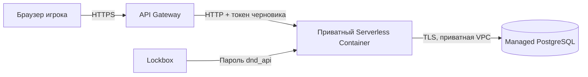

# Go API в Yandex Cloud

Конфигурация от 30 сентября 2026 года. API конструктора работает без авторизации пользователей; доступ к анонимному черновику защищён индивидуальным случайным токеном. Фронтенд конструктора и агент AI Studio подключаются отдельными следующими этапами.



## Ресурсы

| Ресурс | Значение |
| --- | --- |
| Каталог | `b1g8siv8ve2si1qp04nm` |
| HTTPS API | `https://d5dopqqib47kpsh6929m.jki8ffxa.apigw.yandexcloud.net` |
| API Gateway | `dnd-api`, `d5dopqqib47kpsh6929m` |
| Контейнер | `dnd-api`, `bbam71p2dn50q57l250i` |
| Ресурсы ревизии | 1 vCPU, 512 МБ, 100% CPU, до 6 запросов на экземпляр, таймаут 30 с |
| Масштабирование | 0 подготовленных экземпляров, максимум 1 экземпляр на зону |
| Реестр | `dnd-backend`, `crp3ok452qdp2r44ene5` |
| Образ | `cr.yandex/crp3ok452qdp2r44ene5/dnd-api:<git-sha>`, Linux amd64 |
| VPC | `default-1`, `enpeeej3ge2i9lqn8cer` |
| Runtime аккаунт | `dnd-api-runtime`, `aje99fiebjm3lg4k2fpk` |
| CI аккаунт | `dnd-backend-ci`, `aje20v69nl71ka3gjm66` |
| Аккаунт шлюза | `dnd-api-gateway`, `aje3b6tpq50p9b5ae4mf` |

Первый запрос после простоя может ожидать запуск экземпляра. Пул PostgreSQL ограничен двумя соединениями на экземпляр; короткие запросы разделяют этот пул. Количество подготовленных экземпляров не увеличивается без пересмотра стоимости и лимита соединений БД.

## HTTPS и CORS

Шлюз проксирует методы и пути в контейнер по [спецификации](../../infra/backend/api-gateway.yaml). Контейнер не имеет публичного IAM-доступа. Прямой вызов Serverless Containers удаляет `Authorization`, поэтому браузер использует адрес шлюза. [Документация вызова контейнера](https://yandex.cloud/ru/docs/serverless-containers/concepts/invoke) и [интеграции API Gateway](https://yandex.cloud/ru/docs/api-gateway/concepts/extensions/containers).

CORS проверяет точные origin:

- `https://dnd-etozhenerk-b1g8siv8ve2si1qp04nm.website.yandexcloud.net`
- `http://dnd-etozhenerk-b1g8siv8ve2si1qp04nm.website.yandexcloud.net`
- `https://etozhenerk.github.io`

Путь `/DnD/` не является частью origin. При добавлении собственного домена или localhost нужно обновить allowlist и развернуть ревизию. CORS не заменяет авторизацию: список готовых персонажей публичный, черновики требуют Bearer-токена.

## Секреты, сеть и права

- Runtime может читать образы только из реестра `dnd-backend` и содержимое только секрета `dnd_api` (`lockbox.payloadViewer`). Пароль внедряется в `DB_PASSWORD` платформой; CI его не читает.
- Шлюз имеет только `serverless-containers.containerInvoker` на `dnd-api`.
- CI имеет `container-registry.images.pusher` на реестр, `serverless-containers.editor` на контейнер и `iam.serviceAccounts.user` на runtime. Для поиска контейнера официальному action нужен `serverless-containers.viewer` на каталог.
- OIDC federation `ajeiea3qe37gcboihrbj`, credential `ajegd2pnul43mu9dljqe`; доверие только subject `repo:etozhenerk/DnD:ref:refs/heads/main`. Долгоживущие IAM-ключи не создаются.
- Секрет `e6q52abgke68mcms2ntu`, версия `e6qcp09mdr8hvlce0tra`, ключ `postgresql_password`. После ротации обновить ссылку на версию в workflow и развернуть ревизию.
- PostgreSQL принимает TCP 6432 из [служебного диапазона Serverless](https://yandex.cloud/ru/docs/serverless-containers/concepts/networking) в VPC проекта. Публичного IP у БД нет.
- Dockerfile получает CA PostgreSQL с официального адреса Yandex, запускает статический Go-бинарник непривилегированным UID и содержит только три JSON-файла правил/рас. Канонические герои и кампании не включаются в образ.

## Деплой

Workflow `.github/workflows/deploy-yandex-backend.yml` запускается при изменениях бэкенда и трёх JSON-файлов в `main`, либо вручную. Он выполняет `go test ./...`, `go vet ./...`, собирает Docker-образ, отправляет образ с тегом SHA и создаёт ревизию с приватной сетью и ссылкой Lockbox. После запуска проверяет `/health`, `/creator/options` и `/characters` через HTTPS. Ошибка проверки делает workflow неуспешным; автоматического отката нет.

SQL-миграции применяются отдельно от CI от имени владельца БД. Это сохраняет минимальные права runtime. Смена gateway-spec также выполняется отдельно:

```bash
yc serverless api-gateway update dnd-api \
  --folder-id b1g8siv8ve2si1qp04nm \
  --spec infra/backend/api-gateway.yaml
```

Для отката к известному образу повторно развернуть его SHA с теми же параметрами сети и секретов. Не перемещать тег SHA и не удалять образ действующей ревизии.

## Стоимость

Без подготовленных экземпляров нет постоянной оплаты CPU/RAM за простой API. [Serverless Containers](https://yandex.cloud/ru/docs/serverless-containers/pricing) тарифицирует время выполнения и вызовы; [API Gateway](https://yandex.cloud/ru/docs/api-gateway/pricing) — вызовы (первые 100 000 в месяц бесплатны). Дополнительно оплачиваются образы, логи и секреты согласно тарифам.

Для разработки шестью участниками резерв **100–300 ₽/мес** на API и сопутствующие сервисы — ориентир, а не фиксированный платёж или лимит. PostgreSQL остаётся основным постоянным расходом: **4 480,70 ₽/мес** по оценке консоли при создании. Фронтенд Object Storage и будущие AI Studio/SpeechKit оплачиваются отдельно. С ростом количества сохранённых образов требуется пересмотреть хранение; ресурсы не удаляются самим workflow.
