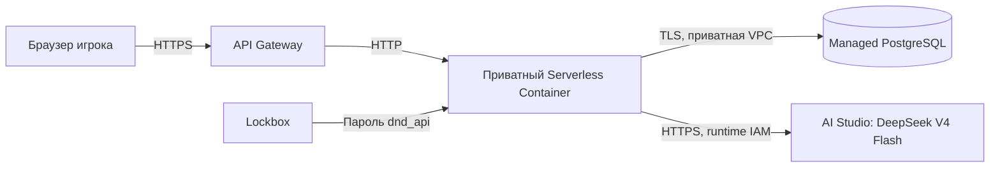

# Go API в Yandex Cloud

Конфигурация от 2 октября 2026 года. API конструктора работает без авторизации пользователей: каталог, создание полной готовой анкеты, список и чтение персонажей публичные. Все `/drafts` закрыты ответом `403 drafts_require_authentication` до подключения входа и проверки владельца. Форма frontend-конструктора хранится в памяти; отдельная сессия советника вызывает AI Studio и учитывает расход в PostgreSQL.



## Ресурсы

| Ресурс | Значение |
| --- | --- |
| Каталог | `b1g8siv8ve2si1qp04nm` |
| HTTPS API | `https://d5dopqqib47kpsh6929m.jki8ffxa.apigw.yandexcloud.net` |
| API Gateway | `dnd-api`, `d5dopqqib47kpsh6929m` |
| Контейнер | `dnd-api`, `bbam71p2dn50q57l250i` |
| Ресурсы ревизии | 1 vCPU, 512 МБ, 100% CPU, до 12 HTTP-запросов на экземпляр, таймаут 120 с |
| Масштабирование | 0 подготовленных экземпляров, максимум 1 экземпляр на зону |
| Реестр | `dnd-backend`, `crp3ok452qdp2r44ene5` |
| Образ | `cr.yandex/crp3ok452qdp2r44ene5/dnd-api:<git-sha>`, Linux amd64 |
| VPC | `default-1`, `enpeeej3ge2i9lqn8cer` |
| Runtime аккаунт | `dnd-api-runtime`, `aje99fiebjm3lg4k2fpk` |
| CI аккаунт | `dnd-backend-ci`, `aje20v69nl71ka3gjm66` |
| Аккаунт шлюза | `dnd-api-gateway`, `aje3b6tpq50p9b5ae4mf` |
| Проверенная ревизия советника | `bbanc9ek66qd45epqtqm` (приёмка 02.10.2026) |
| Коммит проверенного образа | `a33ebb8ef97454b87fb9e4fc7fe9a1ba33f10ef2` |

Первый запрос после простоя может ожидать запуск экземпляра. Пул PostgreSQL ограничен двумя соединениями на экземпляр; короткие запросы разделяют этот пул. Количество подготовленных экземпляров не увеличивается без пересмотра стоимости и лимита соединений БД.

## HTTPS и CORS

Шлюз проксирует методы и пути в контейнер по [спецификации](../../infra/backend/api-gateway.yaml). Контейнер не имеет публичного IAM-доступа. Прямой вызов Serverless Containers удаляет `Authorization`, поэтому браузер использует адрес шлюза. [Документация вызова контейнера](https://yandex.cloud/ru/docs/serverless-containers/concepts/invoke) и [интеграции API Gateway](https://yandex.cloud/ru/docs/api-gateway/concepts/extensions/containers).

CORS проверяет точные origin:

- `https://dnd-etozhenerk-b1g8siv8ve2si1qp04nm.website.yandexcloud.net`
- `http://dnd-etozhenerk-b1g8siv8ve2si1qp04nm.website.yandexcloud.net`
- `https://etozhenerk.github.io`

Путь `/DnD/` не является частью origin. При добавлении собственного домена или localhost нужно обновить allowlist и развернуть ревизию. CORS не заменяет авторизацию: список готовых персонажей публичный, черновики недоступны, в том числе со старым Bearer-токеном.

## Секреты, сеть и права

- Runtime может читать образы только из реестра `dnd-backend` и содержимое только секрета `dnd_api` (`lockbox.payloadViewer`). Пароль внедряется в `DB_PASSWORD` платформой; CI его не читает.
- Runtime имеет `ai.languageModels.user` и `ai.imageGeneration.user` на каталог проекта. Вторая роль выдана 2 октября 2026 для согласованной генерации портретов и иконок. AI вызывается с краткоживущим IAM из metadata; постоянных ключей AI и новых прав CI для этого не создавалось.
- Шлюз имеет только `serverless-containers.containerInvoker` на `dnd-api`.
- CI имеет `container-registry.images.pusher` на реестр, `serverless-containers.editor` на контейнер и `iam.serviceAccounts.user` на runtime. Для поиска контейнера официальному action нужен `serverless-containers.viewer` на каталог.
- Дополнительно CI получает `vpc.user` на каталог для подключения ревизии к сети и `functions.editor` на каталог для ссылок на секреты. Попытка назначить вторую роль только на контейнер не устранила `PERMISSION_DENIED`. Роль на каталог позволяет CI также управлять Cloud Functions в этом каталоге; этот запасной вариант отдельно согласован с пользователем. [Требования action](https://github.com/yc-actions/yc-sls-container-deploy#permissions).
- OIDC federation `ajeiea3qe37gcboihrbj`, credential `ajegd2pnul43mu9dljqe`; доверие только subject `repo:etozhenerk/DnD:ref:refs/heads/main`. Долгоживущие IAM-ключи не создаются.
- Секрет `e6q52abgke68mcms2ntu`, версия `e6qcp09mdr8hvlce0tra`, ключ `postgresql_password`. После ротации обновить ссылку на версию в workflow и развернуть ревизию.
- PostgreSQL принимает TCP 6432 из [служебного диапазона Serverless](https://yandex.cloud/ru/docs/serverless-containers/concepts/networking) в VPC проекта. Публичного IP у БД нет.
- Dockerfile получает CA PostgreSQL с официального адреса Yandex, запускает статический Go-бинарник непривилегированным UID и содержит каталоги правил/рас, мировую карту и инструкцию/подсказки Советника. Обновление добавляет три JSON летописей; для AI используются только публичная проекция карты и опубликованные итоги пройденных историй. Мастерские сведения не попадают в prompt. Канонические герои не включаются в образ.

## Деплой

Workflow `.github/workflows/deploy-yandex-backend.yml` запускается при изменениях бэкенда, каталогов правил/рас, мировой карты и `shared/advisor` в `main`, либо вручную. Он выполняет Go race-тесты, vet и проверку OpenAPI, собирает Docker-образ, отправляет образ с тегом SHA и создаёт ревизию с приватной сетью и ссылкой Lockbox. После запуска проверяет `/health`, `/creator/options`, `/creator/advisor` и `/characters` через HTTPS с ограниченным ожиданием распространения ревизии. Платные генерации CI не вызывает. Ошибка проверки делает workflow неуспешным; автоматического отката нет.

SQL-миграции применяются отдельно от CI от имени владельца БД. Это сохраняет минимальные права runtime. Смена gateway-spec также выполняется отдельно:

```bash
yc serverless api-gateway update dnd-api \
  --folder-id b1g8siv8ve2si1qp04nm \
  --spec infra/backend/api-gateway.yaml
```

Для отката к известному образу повторно развернуть его SHA с теми же параметрами сети и секретов. Не перемещать тег SHA и не удалять образ действующей ревизии.

## Проверка живого сервиса

[CI run 36695111214](https://github.com/etozhenerk/DnD/actions/runs/36695111214) завершился успешно после настройки прав (попытка 3). Проверены HTTPS и чтение PostgreSQL через приватную сеть, 12 классов и семь игровых рас, CORS для разрешённого и запрещённого origin и `OPTIONS` с `Authorization`.

До решения отключить анонимные черновики через HTTP API был выполнен полный цикл: создание, отказ без токена и с чужим токеном, сохранение шести разделов, отклонение неполной анкеты, валидация бюджета 14 очков, завершение, чтение и включение в список. У готового персонажа сохранились навык с одним использованием за бой и предмет. Повторное завершение и чтение использованного черновика вернули `404`. Теперь все действия `/drafts` закрыты; ранее созданная готовая карточка доступна для чтения.

Для проверки создана техническая карточка `Тест деплоя API — 30.09.2026`, ID `cdfe3446-d207-4f64-9056-d3dc39947fdc`, HP 40, AC 14. Она остаётся в списке конструктора как тестовая запись и не относится к канонической книге героев. Реальные готовые персонажи пока не импортированы. Административный WebSQL-доступ закрыт после операции.

## Стоимость

Без подготовленных экземпляров нет постоянной оплаты CPU/RAM за простой API. [Serverless Containers](https://yandex.cloud/ru/docs/serverless-containers/pricing) тарифицирует время выполнения и вызовы; [API Gateway](https://yandex.cloud/ru/docs/api-gateway/pricing) — вызовы (первые 100 000 в месяц бесплатны). Дополнительно оплачиваются образы, логи и секреты согласно тарифам.

Для разработки шестью участниками резерв **100–300 ₽/мес** на API и сопутствующие сервисы — ориентир, а не фиксированный платёж или лимит. Ожидание AI тоже занимает время выполнения контейнера. PostgreSQL остаётся основным постоянным расходом: **4 480,70 ₽/мес** по оценке консоли при создании. Фронтенд Object Storage, AI Studio и будущий SpeechKit оплачиваются отдельно. Серверный бюджет AI — 200 ₽/сессия и 10 000 ₽/месяц. С ростом количества сохранённых образов требуется пересмотреть хранение; ресурсы не удаляются самим workflow.

## Кэш и диагностика чтения

Публичные GET используют ограниченный кэш `internal/httpapi` в памяти экземпляра: 5 минут для каталога, 15 секунд для списка, 1 минута для карточки; до 128 ответов по 256 КиБ. Одинаковые параллельные чтения объединяются. Авторизованные запросы, черновики и ошибки обходят кэш; доступ и CORS проверяются перед ним. Успешная внутренняя запись сбрасывает ответы и не позволяет параллельному старому чтению заполнить их заново.

Заголовок `Server-Timing` возвращает время приложения и состояние кэша. Он помогает отличить работу API от задержек сети, Gateway и старта контейнера. До публикации при трёх чтениях получены примерно 0,94 с для каталога и 0,14/1,04 с для одного персонажа; эти полные сетевые времена сами по себе не доказывают медленный SQL. Количество подготовленных экземпляров остаётся 0; кэш не устраняет запуск после простоя и не переживает смену ревизии. Ресурсы контейнера, сеть, IAM и схема БД в этой доработке не меняются.

### Проверка ревизии с кэшем — 1 октября 2026

[Деплой 36882390120](https://github.com/etozhenerk/DnD/actions/runs/36882390120) успешен. Активна ревизия `bba2p09j9llf2l49qi66` с образом `dnd-api:8239d0a6c5eee1f5f224fb12dbef14db7e2e5c1f`. Правила v3 и CORS доступны через Gateway, анонимные черновики закрыты 403. Четыре последовательных прогретых чтения карточки дали `read_cache=hit`, около 0,01 мс приложения и 66–192 мс полного запроса. Подготовленные экземпляры остаются отключены; первый запрос после простоя может быть медленнее. Полный отчёт: [verification-2026-10-01.md](../design/character-creator/verification-2026-10-01.md).

### Сохранение полной анкеты — 1 октября 2026

[Деплой 36900717618](https://github.com/etozhenerk/DnD/actions/runs/36900717618) успешен, попытка 2. Первая попытка прошла тесты, но остановилась на сетевом таймауте `auth.yandex.cloud`; повторный job выполнил проверки, публикацию и smoke test. Активная ревизия — `bbaoil3nppodokg4fcap`, образ `dnd-api:1349173a43dd9beb9ac3dbe72a1ff9aac57f4230`.

Миграция `000003_character_creation_request` применена отдельно. Новый `POST /characters` проверяет полную анкету v3 и сохраняет персонажа с навыками и предметами одной транзакцией. Успешная запись сбрасывает локальный кэш; первое чтение списка с `fresh=true` обходит кэш другого экземпляра. Через опубликованный браузер создана техническая карточка `3a398ab3-5fac-4fdc-b273-8ed78336dd97`, HP 40, AC 14, создатель NULL. Проверены ошибка 422, переход по ссылке к полю, исправление, сохранение, список и чтение после перезагрузки. [Отчёт](../design/character-creator/verification-saving-2026-10-01.md).

### Портреты и иконки — 2 октября 2026

[Деплой 36930245740](https://github.com/etozhenerk/DnD/actions/runs/36930245740) успешен, код `c88da18e`. `POST /characters` принимает multipart с выбранным портретом и иконками; `GET /assets/{assetId}` возвращает проверенные изображения с ETag и неизменяемым кэшем. Приватный бакет `dnd-character-media-b1g8siv8ve2si1qp04nm` ограничен 1 ГиБ, runtime имеет `storage.uploader` только на него. Статических ключей и новых ВМ нет. Миграции 000004/000005 применены отдельно; WebSQL после проверки выключен. [Хранение и обслуживание](character-media.md), [проверка публикации](../design/character-creator/verification-media-2026-10-02.md).

### Советник — 2 октября 2026

[Деплой 37002393573](https://github.com/etozhenerk/DnD/actions/runs/37002393573) успешен.
Платный чат включён variable `DND_ADVISOR_CHAT_ENABLED=true`; миграции 000006/000007
применены отдельно. Проверены одна реплика DeepSeek, usage и расход 1,6653 ₽,
повтор без нового хода и списания, отказ чужому секрету и CORS новой ручки.
Runtime допускает 12 HTTP-запросов, а журнал ограничивает LLM шестью активными ходами.
CPU/RAM, подготовленные экземпляры и сеть не увеличены. WebSQL выключен.
[Архитектура, проверенные параметры и оставшиеся ограничения](character-advisor.md).
