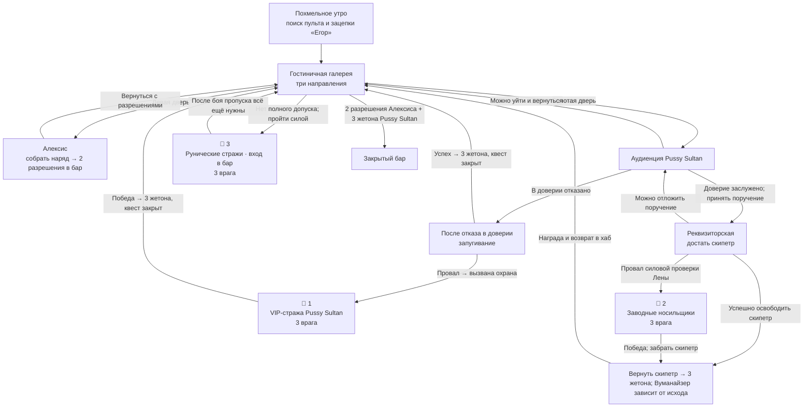
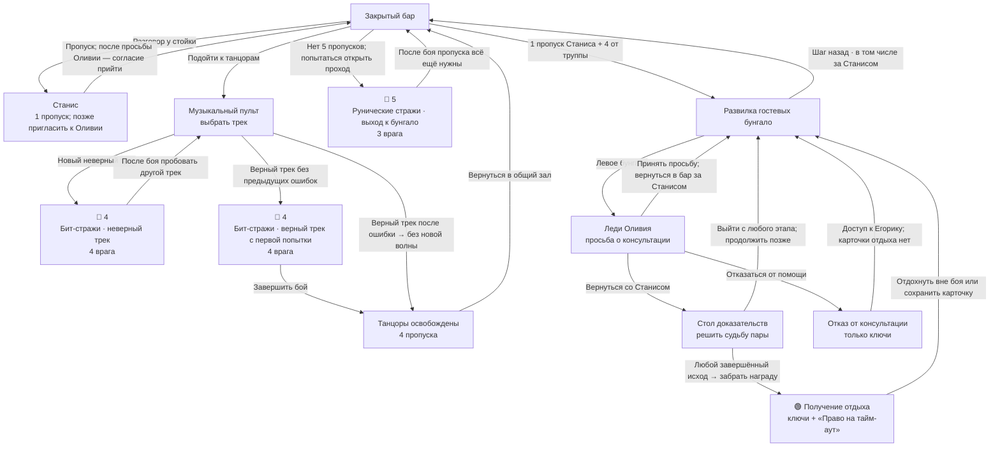
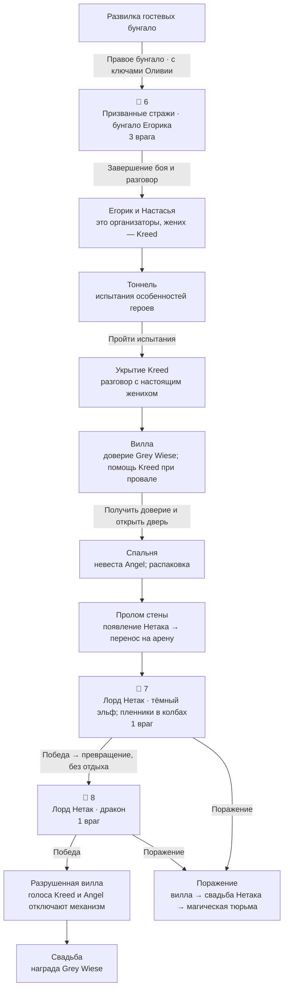

# Пенисуэла — сюжет и боевые точки

Мастерская схема текущей игры на 17 сентября 2026, с актуальными характеристиками после регресса и балансировки. Визуальная редакция: draft. Это описание уже существующих переходов, без новых сцен; баланс обновлён по запросу автора.

🔴 — точка боя, номер повторяется для двух способов вызвать одну встречу. 🟢 — получение карточки отдыха. Стрелки подписаны условиями; направления хаба и возвраты можно проходить в разном порядке.

## Гостиница и доступ в бар



## Бар, бунгало и получение отдыха



## От бунгало Егорика к финалу



## Все боевые точки

| № | Где и с кем | Условие | HP / AC одного врага |
|---|---|---|---|
| 1 | VIP-стража Pussy Sultan ×3 | После отказа в доверии провалено запугивание Pussy Sultan. Альтернатива поручению со скипетром. | 22 / 12 |
| 2 | Заводные носильщики ×3 | Провалена силовая проверка Лены. Провал Линды или Ламберта сам по себе лишь оставляет силовой способ. | 18 / 11 |
| 3 | Рунические стражи · вход в бар ×3 | Герои пытаются пройти в бар силой без 2 разрешений Алексиса и 3 жетонов Pussy Sultan. | 26 / 13 |
| 4 | Бит-стражи · неверный трек ×4 | Любой новый неверный трек либо верный трек без предыдущих ошибок. Верный после ошибки не вызывает дополнительную волну. | 28 / 14 |
| 5 | Рунические стражи · выход к бунгало ×3 | Герои пытаются открыть проход к бунгало без 1 пропуска Станиса и 4 пропусков труппы. | 26 / 13 |
| 6 | Призванные стражи · бунгало Егорика ×3 | Первый вход к Егорику с ключами Оливии: обязательная боевая сцена основного маршрута. | 38 / 14 |
| 7 | Лорд Нетак · тёмный эльф; пленники в колбах ×1 | После появления Нетака на вилле. Первая обязательная фаза; колбы — атакуемые объекты, не дополнительные враги. | 176 / 16 |
| 8 | Лорд Нетак · дракон ×1 | После победы над тёмным эльфом. Вторая обязательная фаза; HP героев не восстанавливаются между фазами. | 176 / 16 |

## Как читать ветки и повторы

- Точки 1 и 2 относятся к разным исходам аудиенции: после враждебного исхода поручение со скипетром закрыто. Они не являются двумя обязательными боями подряд.
- Точки 3 и 5 используют одну встречу рунической охраны в двух разных местах. Победа не выдаёт пропуска и не отключает проверку доступа; очередная попытка без пропусков может снова вызвать охрану.
- У пульта сейчас 11 неверных треков. Каждый можно ошибочно выбрать только один раз; уже отклонённый трек блокируется. До освобождения труппы возможны повторные волны по 4 бит-стража. Верный с первой попытки даёт одну волну; после ошибочных попыток — завершает головоломку без новой волны. Эти два выхода точки 4 альтернативны.
- По обычному пути через танцоров до первого получения отдыха неизбежна минимум одна волна бит-стражей. Остальные ранние бои зависят от провалов и решений. Проходы нельзя считать обходом головоломки после победы над охраной.
- Оливия открывает консультацию после возвращения за Станисом в бар. Успешное убеждение или обещание выслушать его после провала дают согласие. Обратный путь идёт через общий зал, развилку и бунгало Оливии.
- Любой завершённый исход консультации даёт ключи и «Право на тайм-аут» после отдельного получения награды. При отказе выдают только ключи; отдых можно получить, вернувшись к квесту позже. Поэтому бой у Егорика может оказаться до отдыха, если сначала взять ключи без консультации.
- Зелёная точка означает получение карточки. Применить её можно позже вне боя: полное HP всей партии и восстановление зарядов имеющихся предметов; все навыки восстанавливаются, включая лимиты на кампанию. Сама карточка расходуется один раз.
- В тоннеле и у двери Grey Wiese есть проверки и испытания, но отдельных действующих встреч с врагами там нет. Архивные дублёры, Алгоритм советов, кордебалет и старый трёхфазный финал не включены.
- Поражение в любой фазе Нетака ведёт к плохому финалу. После победы над обеими фазами — возвращение на виллу, отключение механизма голосами пары и свадьба.

## Основания и проверка

- Канон: `content/campaigns/penisuela-gallery-gameplay.json`, `penisuela-session-preview.json`, `penisuela-olva-quest.json`, действующий сценарий `penisuela-session-preview-guide.md`.
- Исходный утверждённый порядок: `story-graph.json` и `outline.md`. Эта карта дополнительно раскрывает внутренние бои, пространственные развилки и возвраты.
- Допуск в бар, выход к бунгало и музыкальные волны сверены с `hotelBarAccess.ts`, `HotelGalleryAdventure.tsx`, `ClosedBarAdventure.tsx`, `dancePuzzleRules.ts` и `useGallerySession.ts`.
- Машинная версия этой же карты: `combat-story-graph.json`. Уникальность узлов, ссылки, достижимость финалов и отмеченные циклы проверяются локальным валидатором. Подписи условий не заменяют формальный движок кампании.
- Длительности в JSON унаследованы от прежнего графа; боевые маркеры не добавляют отдельную оценку. Диапазон валидатора для путей без повторов не является прогнозом времени прохождения. Максимум с повторными попытками пройти без пропусков не ограничен сценарием.
- Новые канонические факты, миграции и изменения игровых правил: отсутствуют.

Фактическая проверка 14 сентября 2026:

```text
Graph valid: 34 nodes, 1 starts, 2 endings, routes 118-118m
Coverage valid: 28 active scene IDs; 8 combat points; 7 encounter definitions; all 52 displayed edges match JSON.
```

`jq empty` и `git diff --check` завершились без ошибок. Число 118 минут — механический результат старых весов только для путей без повторного посещения узла; это не оценка длительности этой кампании и не учитывает время всех возможных боёв и квестовых возвратов.
