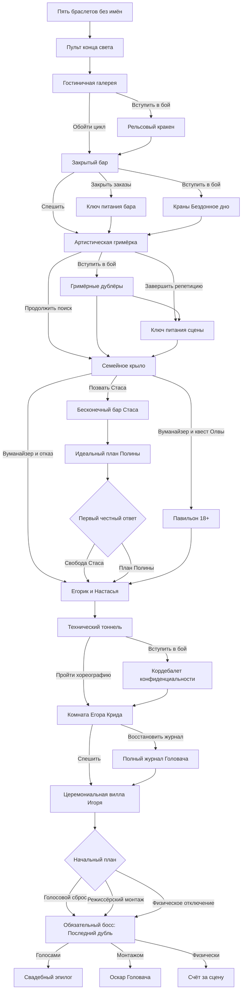

# Сюжетный граф «Мальчишника конца света»

Статус: `approved`
Машиночитаемый источник: `story-graph.json`

## Основной поток

Циклов нет. Гримёрка является обязательной частью поиска Егорика, а не самостоятельной веткой к Криду. В семейном крыле герои выбирают взаимоисключающие ветки: передать Полине Вуманайзер и получить предложение Олвы либо сохранить предмет и пройти бескровную парную сессию. Обе ветки сходятся перед встречей с Егориком.

## Узлы

| ID | Роль | Минуты | Главный результат |
| --- | --- | ---: | --- |
| `tavern-invitation` | вступительная кат-сцена | 5 | Крайнеплот получает конверт и отправляет Кострюльку |
| `hotel-overload` | обязательный | 30 | Таймер, пульт, запись «Для Егорика» |
| `hotel-gallery` | обязательный | 20 | Бытовые подтверждения ложной версии |
| `rail-kraken-fight` | необязательный бой | 12 | Рельсовый кракен выведен из строя |
| `closed-bar` | обязательный | 15 | Путь в артистический коридор; Стас разрешает позвать его на прямой разговор |
| `bar-module-shutdown` | необязательный | 10 | Первый ключ питания |
| `bar-tap-fight` | необязательный бой | 12 | Первый ключ питания добыт силой |
| `artists-dressing-room` | обязательный | 30 | Крид раскрыт как артист; путь всё ещё ведёт к Егорику |
| `dressing-room-double-fight` | необязательный бой | 12 | Satyr освобождён, получена репетиционная команда |
| `stage-module-shutdown` | необязательный | 10 | Второй ключ питания |
| `guest-bungalows` | обязательная социальная сцена | 10 | Выбор Вуманайзера либо парной сессии |
| `show-18-pavilion` | необязательный сайд-квест | 20 | Получена «Красная кнопка 18+» |
| `couples-session-stas` | бескровная социальная сцена | 7 | Стас объясняет желание свободы и привычку избегать выбора |
| `couples-session-polina` | бескровная социальная сцена | 7 | Полина объясняет потребность в семье и гарантированном будущем |
| `couples-session-choice` | социальная развилка | 10 | Развод ради Стаса либо добровольный семейный план Полины |
| `egorik-bungalow-reveal` | обязательный мидпойнт | 20 | Егорик не жених; Крид становится главным подозреваемым |
| `groom-tunnel` | обязательный | 25 | Доступ к комнате жениха |
| `corp-de-ballet-fight` | необязательный бой | 15 | Кордебалет отключён |
| `groom-preparation-room` | обязательный | 20 | Крид подтверждён как жених; названа невеста |
| `restore-control-log` | необязательный | 15 | Открыт режиссёрский финал |
| `ceremony-villa` | точка необратимости | 25 | Игорь Румянец и второй голосовой ключ |
| `final-choice` | развилка | 0 | Выбор начального плана обязательной битвы |
| `last-take-boss` | обязательный босс | 60 | Три контура закрыты одним или несколькими способами |
| `wedding-epilogue` | концовка | 15 | Свадьба состоялась |
| `director-epilogue` | концовка | 15 | Символический «Оскар» |
| `shutdown-epilogue` | концовка | 15 | Свадьба перенесена, сцена разрушена |

## Состояние

Ключевые флаги:

- `pendant-connected` — кулон сохранил канал к пульту;
- `bar-power-key`, `stage-power-key` — промежуточные модули отключены;
- `bar-order-closed` — Прохор штатно завершил бесконечный заказ;
- `dance-troupe-allies` — освобождённая клубная труппа готова увести прожекторы в финале;
- `stage-rehearsal-cue` — Satyr дал одноразовую команду остановки сценической реакции;
- `stas-met`, `stas-call-consent` — герои встретили Стаса в баре, и он разрешил позвать его для прямого решения;
- `family-branch-womanizer`, `family-branch-therapy` — зафиксирована одна из взаимоисключающих веток семейного крыла;
- `womanizer-given-to-polina` — Полина получила артефакт и покинула сцену до встречи с Егориком;
- `show-18-complete` — Алгоритм универсальных советов остановлен, а у героев есть `red-button-18-plus`;
- `stas-motivation-heard`, `polina-motivation-heard` — партия выслушала обе мотивационные сцены;
- `stas-marriage-ended` — Стас сказал первое прямое «нет», и брак завершён;
- `polina-family-plan` — супруги добровольно продолжили семейный план на новых условиях;
- `clear-choice-confirmation` — Олва подтвердила ясность решения; точный игровой эффект определит механика;
- `egorik-nastya-allies` — знакомая пара помогает в финале;
- `groom-voice-key`, `bride-voice-key` — собраны голоса пары;
- `control-log-restored` — доступна режиссёрская версия;
- `couple-trust` — пара добровольно участвует в штатном сбросе;
- `footage-authorized` — запись можно использовать с согласия пары.
- `final-plan-standard`, `final-plan-director`, `final-plan-physical` — выбранный в начале боя подход; внутри фаз его можно сменить.

Счётчик `time-pressure` растёт при подготовительных действиях и осложнениях. `pre-final-combats` показывает, сколько из пяти потенциальных боёв действительно состоялось. При `time-pressure` выше 4 режиссёрский план закрывается, но штатный и физический способы остаются доступны.

## Условия обязательного босса и эпилогов

Все пути из `final-choice` ведут в `last-take-boss`. Выбор определяет начальный план, но герои могут сменить способ между тремя фазами.

### Штатный сброс

Нужны оба голосовых ключа и доверие пары. Ключи питания и союзники не являются обязательными, но снимают отдельные атаки босса.

### Режиссёрская версия

Нужны подключённый кулон, восстановленный журнал и `time-pressure <= 4`. Согласие на использование записи влияет на эпилог, но физически не блокирует попытку.

### Физическое отключение

Безусловный запасной выход и всегда доступный способ завершить последнюю фазу.

## Типовые маршруты

1. **Срочное физическое отключение — 275 минут.** Все промежуточные бои и подготовительные отключения обойдены.
2. **Обычный вечерний маршрут — 319–354 минуты.** Выбрана одна из веток семейного крыла, состоялись примерно два доступных боя; часть систем отключена мирно.
3. **Режиссёрская версия — от 290 минут.** Восстановлен журнал; бои и ключи питания выбираются по состоянию партии.
4. **Полная зачистка с Павильоном — 371 минута.** Состоялись все пять потенциальных боёв, собраны доступные преимущества и пройден обязательный босс.
5. **Длинный терапевтический маршрут — 375 минут.** Вместо Павильона пройдены три сцены парной сессии, выбрана судьба брака и собраны остальные доступные подготовки.

Минимальная длительность графа — 275 минут, максимальная — 375 минут. Оба значения укладываются в рекомендуемый диапазон 275–375 минут.

## Запасные пути улик

- Направление к Егорику дублируют запись, фотографии и гостиничный счёт.
- Путь в гримёрку дублируют печать церемониального конверта, жетон закрытого бара от Алексис и журнал бара.
- Личность Крида как артиста раскрывают минимум два набора сценических следов.
- Его роль жениха подтверждают запись Настасьи Затейницы, голосовой ключ и закрытая комната подготовки.
- Имя Игоря Румянца дают Крид, церемониальная запись и ответ из виллы.
- Потеря технической ветки закрывает только режиссёрскую версию, но не кампанию.

## Открытые решения

- Граф из 26 узлов утверждён; дальнейшие изменения его структуры требуют возврата к `design-dnd-story-graph`.
- Конкретные проверки, восстановление и последствия обоих счётчиков определит `design-dnd-gameplay`.
- Полный сценарий сцен готовится отдельным этапом; речевые пресеты появятся после его утверждения.
