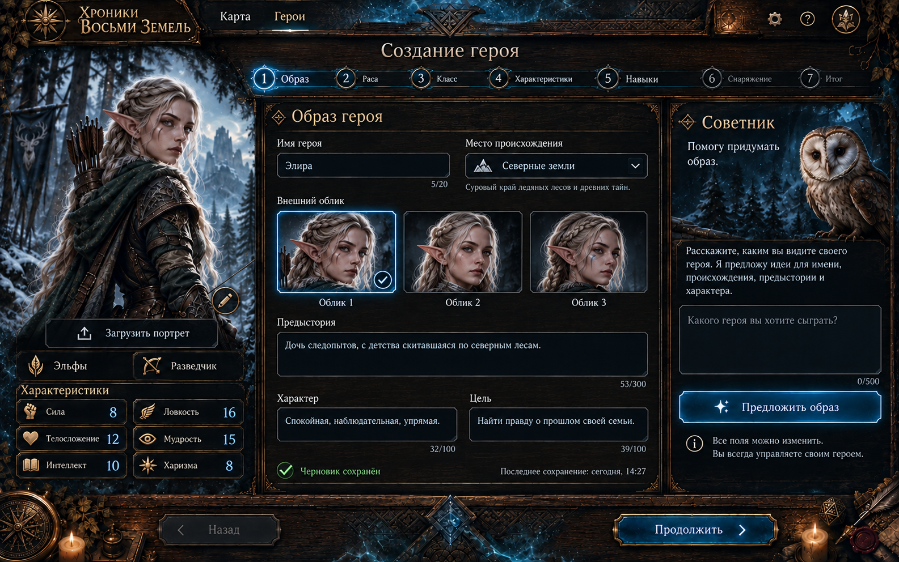
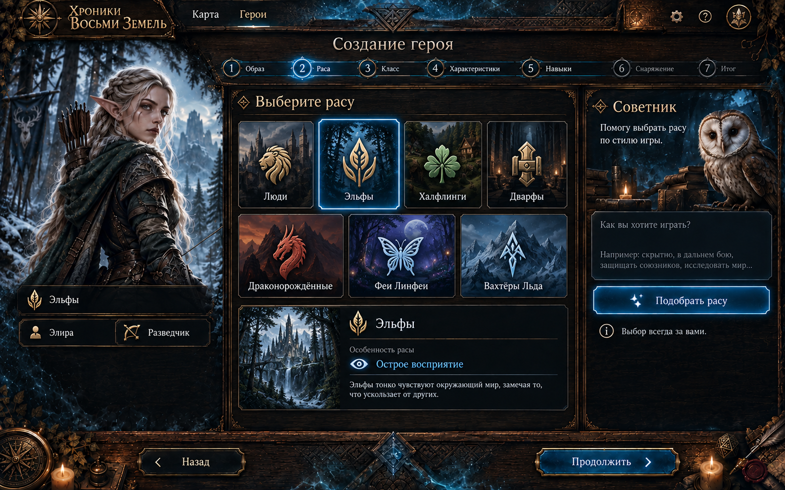
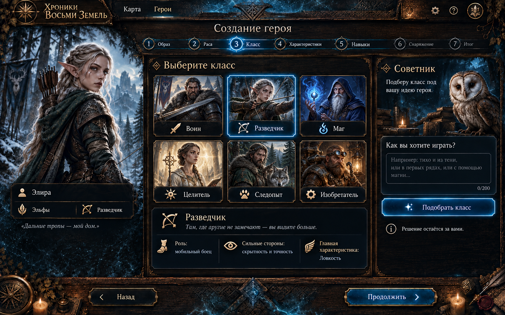
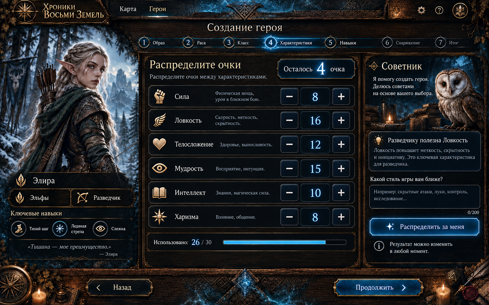
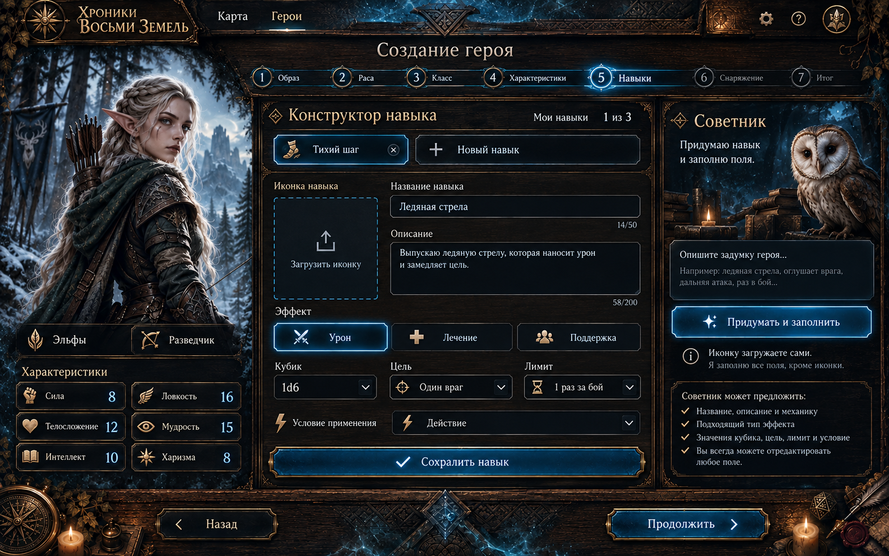
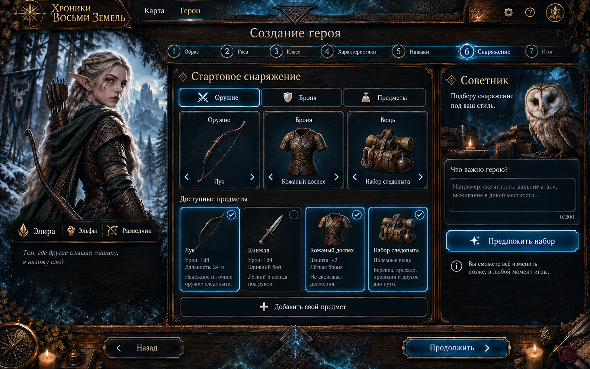
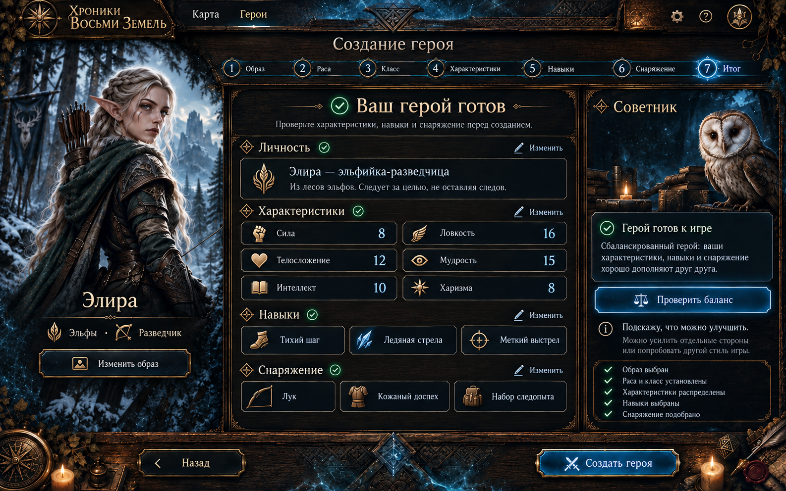

# Создание героя — визуальная концепция

Семь экранов единого конструктора. Это макеты интерфейса, а не утверждённые игровые правила. Рас и название расовой особенности на втором экране взяты из `content/races.json`; классы, навыки, предметы, очки характеристик и числовые эффекты на остальных экранах показаны как примеры.

## Применение в интерфейсе

Основной визуальный стиль одобрен автором. Реализованы список, карточка и все семь этапов конструктора. Сохранение готового персонажа, облачная загрузка файлов и подключение советника остаются отдельными этапами. 1 октября 2026 года автор разрешил публикацию через существующие CI-деплои. Результат проверки фиксируется в [отчёте](verification-2026-10-01.md).

В списке карточка готового персонажа показывает портрет целиком, имя, расу, класс, HP и защиту. Имя, портрет и ссылка открывают его страницу. На странице имя, происхождение и роль вынесены в отдельную шапку; большой портрет, история и параметры образуют основную область. Навыки и снаряжение находятся в отдельных секциях ниже. На планшете основная область перестраивается в две колонки, на телефоне — в одну. Для списка и страницы используется общий `CharacterPortrait` с той же заглушкой в капюшоне, что и в конструкторе. Отсутствие URL, пустая строка и ошибка загрузки изображения включают заглушку. Необязательный `portraitUrl` описан в YAML-контракте и поддержан клиентом; текущий API ещё не сохраняет медиа и может не отдавать это поле. Старые ответы и сохранённые характеристики остаются совместимыми.

- «Назад» и заголовок находятся в одной строке; нижних дублирующих кнопок навигации нет.
- Активен светящийся круг номера этапа; прямоугольной подложки у выбранного этапа нет.
- Следующие этапы блокируются до заполнения и проверки предыдущих; замок виден без наведения, доступная подпись и подсказка при наведении объясняют условие открытия. Прямой URL не обходит блокировку. На узких экранах лента этапов прокручивается только горизонтально внутри своего блока и показывает активный этап. Вертикальной прокрутки у ленты нет.
- До авторизации форма хранится только в памяти открытого конструктора. Серверных черновиков, автосохранения и восстановления между посещениями нет. Сохранение незавершённой анкеты появится после входа и проверки владельца.
- Компоновка следует эскизу: открытая область портрета слева, форма в центре, сова и советник справа. Заголовок «Создание героя» расположен прямо на фоне леса, без деревянной подложки. Кнопка «Назад» использует тёмную подложку и золотой текст общего интерфейса.
- Форма, советник, список и карточка готового персонажа используют общий тёмный материал с приглушённой фактурой дерева. Раса, класс и характеристики находятся на одной подложке. У полей и кнопок смягчены углы; прямоугольных обводок, вращаемых уголков и отдельной декоративной рамки нет. Полоска между этапами и основной формой убрана; акцент выбора и клавиатурный фокус остаются видимыми.
- Необязательное поле «Внешность» находится рядом с предысторией. Раскрывающегося блока нет; ввод текста не увеличивает высоту поля автоматически.
- Сова на ветке выводится отдельным изображением с настоящим альфа-каналом, исходными пропорциями и без `cover`.
- Пустой портрет — анонимный путешественник в капюшоне. Вместо кадрирования есть горизонтальная галерея загруженных вариантов: до восьми PNG/JPG/WebP по 10 МБ. Варианты сравниваются рядом, выбранный показывается целиком слева; их можно переключать и удалять. На десктопе предпросмотр остаётся в пределах высоты окна при прокрутке длинной формы.
- Вертикальные, квадратные и горизонтальные портреты выводятся через общий `PortraitImage`: основное изображение сохраняется целиком, свободное пространство заполняет мягкая затемнённая копия этого же изображения. Галерея использует тот же способ показа.
- Характеристики показывают прочерки до выбора класса. На мобильном экране все шесть значений выводятся одной колонкой рядом с портретом.
- Цифры этапов и характеристик используют ровные табличные цифры; подписи и элементы управления выровнены по центру. В узкой боковой колонке на ширинах 681–1100 px характеристики также выводятся одной колонкой.
- Расы и их особенности берутся из канона. На этапе выбора расы объясняется её влияние на героя. Двенадцать классов задают неснижаемую основу характеристик стоимостью 10 очков и основу HP/защиты; у каждого класса есть сильные стороны и отрицательные модификаторы в слабых характеристиках. На этапе выбора класса показаны его описание, стиль игры и слабость; числовые характеристики остаются в единственном боковом предпросмотре.
- Игрок распределяет ещё 4 очка усиления по прежней таблице цен. Можно улучшать сильные стороны или компенсировать минусы, но нельзя опустить характеристику ниже основы класса. Кнопка «−» возвращает только потраченные усиления. Есть «Сбалансированный вариант» и «Сбросить усиления». При смене класса с уже потраченными очками требуется подтверждение сброса; имя, раса, портреты и остальные разделы сохраняются. Правила и полные основы классов: [character-creation-rules.md](../../architecture/character-creation-rules.md).
- Правила и ошибки распределения очков открываются в общем `Tooltip` по наведению, фокусу или нажатию. Подсказка размещается поверх интерфейса в пределах окна, закрывается по Escape и нажатию вне её; появление ошибки не меняет высоту формы.
- Навыки переключаются отдельными вкладками: базовая атака и до трёх активных навыков. Игрок вводит имя и описание, загружает необязательную иконку и выбирает допустимый профиль урона или лечения. Бюджет — 6 очков; одинаковые профили не повторяются. Повествовательные особенности и предметы не выдают формальных усилений. Значения и ограничения следуют утверждённым JSON, а не цифрам на исходных картинках.
- Итог показывает личность, расовую особенность, характеристики, HP/AC, навыки и предметы; ссылки «Изменить» возвращают к разделу с сохранением введённых данных в памяти. Серверная запись и советник пока отключены с пояснением.
- Заголовки — Cormorant Garamond, текст и поля — Alegreya. Файлы и лицензии находятся в `frontend/src/shared/assets/fonts/`; внешних запросов к Google Fonts при открытии страницы нет.
- Логотип шапки — цельная плашка с золотым солнцем и названием внутри изображения. Пропорции PNG сохраняются; текст не выступает отдельно из плашки. Исходник, промпт и способ генерации описаны в [logo-prompt.md](logo-prompt.md).

Декоративные файлы находятся в `frontend/assets/concepts/ui/character-creator/` и зарегистрированы как `reference` в manifest. Они не добавляют героя или локацию в канон. Генерация выполнена встроенным `imagegen`. Для пустого портрета используется анонимный силуэт с закрытым лицом; он не задаёт расу, класс или пол героя. Загруженные игроком изображения используются только для локального предпросмотра и не меняют канонические ассеты.

Ассеты `reference-owl.png`, `reference-forest.png`, `reference-wood.png` и `reference-trim.png` созданы с визуальной опорой на `01-appearance.png`: сова на ветке, снежный лес без интерфейса, материал тёмного дерева и прямая резная перекладина с бронзовой отделкой. `hero-silhouette.png` — путешественник в тёмном бирюзовом капюшоне с закрытым лицом, кожаной бронёй и бронзовой вышивкой. Дополнительная рамка была отклонена и в приложении не используется.

Карточки семи рас в `ui/character-creator/races/` сгенерированы на основе существующих рендеров из `assets/concepts/races/`: на каждой изображены взрослые мужчина и женщина соответствующего народа. Для двенадцати классов подготовлены отдельные эмблемы с настоящим прозрачным фоном в `ui/character-creator/classes/`. Эти ассеты подключены только к конструктору и ожидают визуального просмотра автора; исходные рендеры и канонические данные рас не меняются. Промпты, референсы и пути всех 19 файлов сохранены в [asset-prompts-2026-10-01.json](asset-prompts-2026-10-01.json).

Источники шрифтов: [Cormorant Garamond](https://github.com/google/fonts/tree/main/ofl/cormorantgaramond), [Alegreya](https://github.com/google/fonts/tree/main/ofl/alegreya), лицензия SIL OFL 1.1. Общий `--font-display` старых игровых экранов не изменён.

### Переходы и ожидание данных

Список, конструктор и карточка появляются мягко и по секциям; портрет получает короткий световой акцент. Поддерживаемые браузеры используют View Transitions, шапка остаётся на месте. При переключении этапа меняется только его содержимое, анкета и изображения сохраняются. При уменьшении движения в системных настройках эффекты отключены. Первичная загрузка списка и карточки показывает спокойные скелетоны той же компоновки; повторное чтение использует кэш TanStack Query и не заменяет готовую страницу заглушкой.

## 1. Образ

## 2. Раса

## 3. Класс

## 4. Характеристики

## 5. Навыки

Игрок заполняет навык вручную или просит советника придумать его и заполнить поля. Иконку загружает игрок.

## 6. Снаряжение

## 7. Итог

